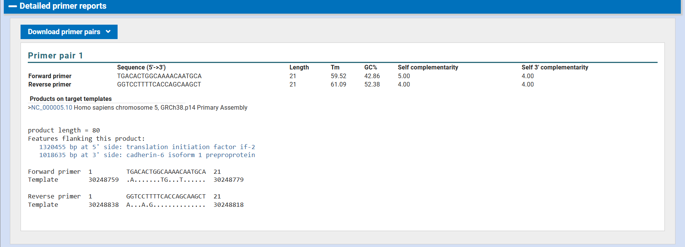

# NGS-Primer-Design-HPRT1
In-silico design and specificity analysis of PCR primers for the human HPRT1 gene using NCBI Primer-BLAST as part of an NGS practical assignment.
# Primer Design and Specificity Analysis of Human HPRT1 Gene

## Overview
This repository documents the in-silico design and specificity analysis of PCR primers for the human HPRT1 gene. This work was carried out as part of an academic practical module on Next-Generation Sequencing (NGS) to understand primer design parameters and target specificity.

Primer specificity was evaluated using NCBI Primer-BLAST against the human reference genome.

---

## Target Gene Information
- Gene Name: HPRT1 (Hypoxanthine phosphoribosyltransferase 1)
- Accession Number: NM_000194.3
- Organism: Homo sapiens (Human)

---

## Primer Sequences

Forward Primer (5′ → 3′):
TGACACTGGCAAAACAATGCA

Reverse Primer (5′ → 3′):
GGTCCTTTTCACCAGCAAGCT

---

## Primer Properties
- Melting Temperature (Tm):
  - Forward: ~59.4 °C
  - Reverse: ~60.1 °C
- GC Content:
  - Forward: 45.5%
  - Reverse: 52.4%
- Expected Amplicon Size: 94 bp

---

## Primer-BLAST Specificity Check
Primer specificity was analyzed using NCBI Primer-BLAST against the Homo sapiens genome (taxid:9606).

---

## Specificity Statement
The designed primer pair specifically amplifies the human HPRT1 gene and does not show any significant off-target amplification in the human genome.

---

## Tools Used
- NCBI Gene Database
- NCBI Primer-BLAST

---

## Author
Prepared for academic submission and practical training in molecular biology and NGS workflows.
